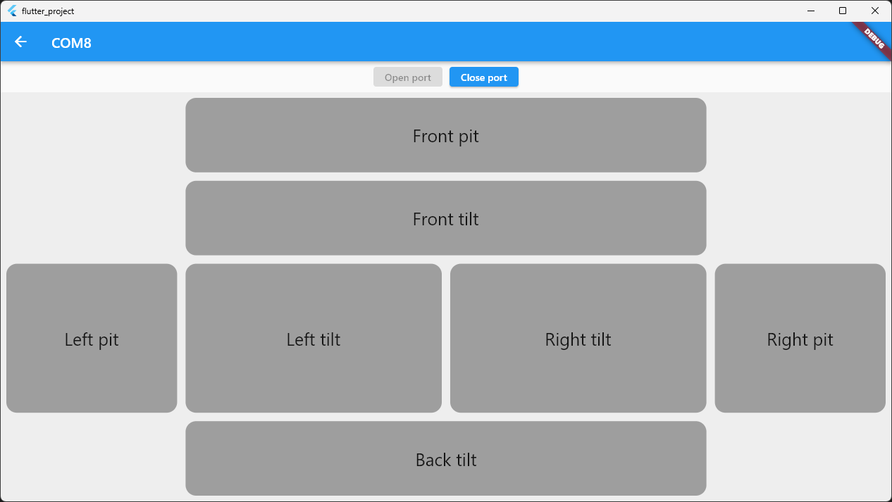
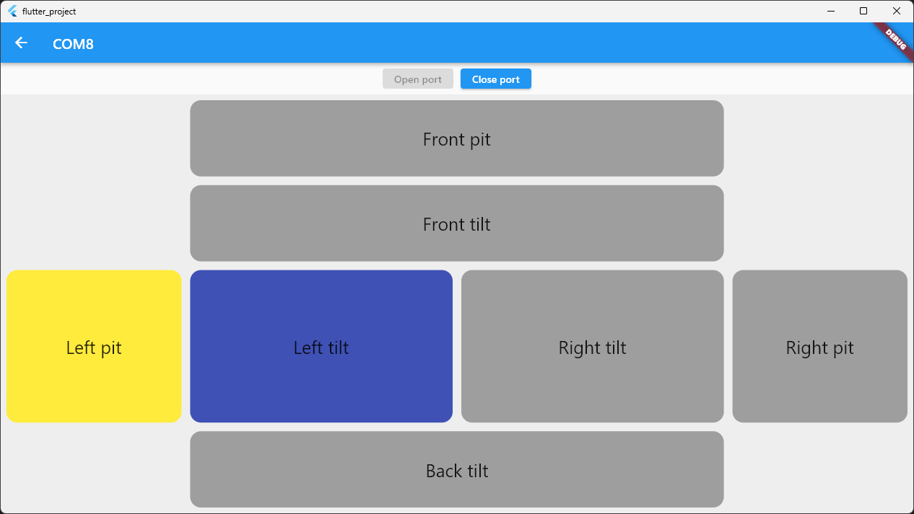

### Flutter 3.3.10

### Flutter application
We have prepared simple Flutter application for data visualising

So, processing status code, that we got from microcontroller, we can see turned on blocks
